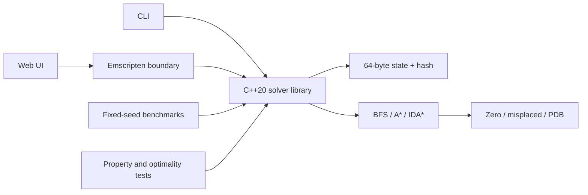

# Pyraminx Search Lab

An optimal-search laboratory for a four-layer tetrahedral twisty puzzle, implemented as a reusable C++20 library, command-line application, deterministic benchmark suite, and WebAssembly visualizer.

The project compares breadth-first search, A*, and memory-bounded IDA* using an admissible misplaced-sticker bound and a reverse-generated pattern database. Every reported solution is replayed against the input state, and informed-solver solution lengths are tested against BFS at tractable depths.

> The original 1,300-line prototype is preserved in [`legacy/`](legacy/) for provenance. The production implementation replaces its mutable triangles and position-history stacks with a 64-byte value type.

## Why this project is interesting

- **Algorithm engineering:** three optimal graph-search strategies expose clear time/memory tradeoffs.
- **Heuristic design:** a 5,184-entry pattern database is generated by reverse BFS over three tracked facelets.
- **Data-oriented state:** `std::array<std::uint8_t, 64>` gives value semantics, deterministic hashing, and inexpensive copies.
- **Measured results:** fixed seeds, resource limits, solution verification, node counts, timing, and estimated memory—not unmeasured performance claims.
- **Production workflow:** CMake, portable warnings, sanitizers, coverage artifacts, deterministic tests, benchmark smoke tests, and a browser build powered by the same C++ core.

## Measured performance

On the fixed-seed benchmark suite (Apple Clang 17, release build, five cases per depth), A* with the pattern database expanded **99.7% fewer median nodes at scramble depth 4** than BFS: 73 versus 26,764. IDA* used an estimated 0.8 KiB of search storage at that depth, illustrating its memory advantage.

| Scramble depth | Solver | Heuristic | Solved | Median solution | Median expanded | Median time (ms) | Est. peak (KiB) | Heuristic accuracy |
|---:|---|---|---:|---:|---:|---:|---:|---:|
| 1 | BFS | none | 5/5 | 1 | 10 | 0.047 | 76.9 | 0% |
| 1 | A* | PDB | 5/5 | 1 | 2 | 0.010 | 10.2 | 100% |
| 1 | IDA* | PDB | 5/5 | 1 | 1 | 0.002 | 0.3 | 100% |
| 2 | BFS | none | 5/5 | 2 | 196 | 1.369 | 1,208.6 | 0% |
| 2 | A* | PDB | 5/5 | 2 | 6 | 0.098 | 46.1 | 50% |
| 2 | IDA* | PDB | 5/5 | 2 | 7 | 0.061 | 0.5 | 50% |
| 3 | BFS | none | 5/5 | 3 | 5,006 | 36.363 | 28,733.6 | 0% |
| 3 | A* | PDB | 5/5 | 3 | 11 | 0.108 | 86.5 | 67% |
| 3 | IDA* | PDB | 5/5 | 3 | 20 | 0.149 | 0.6 | 67% |
| 4 | BFS | none | 5/5 | 4 | 26,764 | 448.510 | 152,194.5 | 0% |
| 4 | A* | PDB | 5/5 | 4 | 73 | 0.689 | 548.7 | 50% |
| 4 | IDA* | PDB | 5/5 | 4 | 140 | 1.158 | 0.8 | 50% |
| 5 | BFS | none | 0/5 within 10 s | — | — | — | — | — |
| 5 | A* | PDB | 5/5 | 5 | 882 | 9.598 | 6,461.5 | 40% |
| 5 | IDA* | PDB | 5/5 | 5 | 6,721 | 52.291 | 0.9 | 40% |

Times are machine-specific. “Estimated peak” models the solver's stored states and container overhead; it is not process RSS. Heuristic accuracy is `h(start) / optimal solution length`. Full methodology and a copyable table are in [`benchmarks/results.md`](benchmarks/results.md).

## Architecture



```text
include/pyraminx/   Public state, move, heuristic, and solver APIs
src/                Library implementation and CLI
tests/              Invariants, optimality, admissibility, verification
benchmarks/         Reproducible fixed-seed performance suite
web/                Responsive visualizer and Emscripten C boundary
.github/workflows/  Six-platform build/test matrix plus quality jobs
legacy/             Original prototype, excluded from all builds
```

## State representation and moves

`State` stores 64 facelet identities in a contiguous array. The value in a position identifies the facelet's exact solved location, so equality and hashing need no heap allocation or serialization. A move is applied as disjoint three-cycles derived from the original prototype's rotations.

The notation is `U`, `L`, `R`, or `B` for the tetrahedron axis followed by a layer number from the tip (`1`) to the opposite outer layer (`4`); a prime means counterclockwise. For example:

```text
U1 L2 R3' B4
```

Every move has a tested inverse, and applying any clockwise move three times restores the state. Scramble generation rejects consecutive turns of the same layer.

## Search algorithms

| Solver | Optimal | Main tradeoff |
|---|---|---|
| Breadth-first search | Yes | Correctness baseline; frontier memory grows quickly |
| A* | Yes with included heuristics | Usually expands far fewer nodes; retains discovered states |
| IDA* | Yes with included heuristics | Near-linear search memory; may re-expand nodes |

The misplaced bound is `ceil(misplaced / 36)` because one move affects at most 36 positions. It cannot overestimate the moves remaining.

The pattern database tracks three facelets and is generated once by reverse BFS from their solved abstraction. Each abstract transition is induced by a legal puzzle move, so the table stores the exact abstract distance. Relaxing the other 61 facelets can only make the problem easier; therefore the abstract distance is a lower bound on the full distance. The production heuristic takes `max(misplaced, pdb)`, which remains admissible.

## Build and run

Requirements: a C++20 compiler and CMake 3.20 or newer.

```bash
cmake -S . -B build -DCMAKE_BUILD_TYPE=Release
cmake --build build --parallel
ctest --test-dir build --output-on-failure
```

Solve a deterministic random scramble:

```bash
./build/pyraminx-cli --random 5 --seed 42 --algorithm astar --heuristic pdb
```

Solve an explicit scramble with IDA*:

```bash
./build/pyraminx-cli --scramble "U4 R3' L2 B1" --algorithm idastar
```

The CLI prints the unfolded state, optimal solution, nodes expanded/generated, peak frontier, estimated memory, runtime, and an independent replay-verification result. Run `./build/pyraminx-cli --help` for resource-limit and display options.

## Benchmarks

```bash
./build/pyraminx-benchmark             # 3 cases at depths 1–4
./build/pyraminx-benchmark 5 5         # published table: 5 cases at depths 1–5
```

The seed (`0xC0FFEE`), scramble policy, and ten-second per-case limit are fixed in source. The runner emits Markdown so a result can be reviewed before being copied into documentation. CI runs a smaller deterministic smoke suite and publishes it as an artifact.

## Browser visualizer

The visualizer retains the solver core by compiling it to WebAssembly. Install and activate the Emscripten SDK, then run:

```bash
emcmake cmake -S . -B build-web -DCMAKE_BUILD_TYPE=Release \
  -DPYRAMINX_BUILD_TESTS=OFF -DPYRAMINX_BUILD_BENCHMARKS=OFF
cmake --build build-web --target pyraminx-web
python3 -m http.server 8000 --directory web
```

Open `http://localhost:8000`. You can enter notation, generate a scramble, choose a solver and heuristic, inspect metrics, and animate the returned solution. The page is responsive and works without a server component; only static hosting is needed.

The included `pages.yml` workflow builds the WebAssembly bundle with the pinned Emscripten SDK and deploys `web/` after a push to `main`. In the repository settings, select **GitHub Actions** as the Pages source once; then add the generated URL near the top of this README.

## Quality gates

GitHub Actions builds and tests Debug and Release configurations on Linux, macOS, and Windows. The CMake build fetches the pinned GoogleTest 1.17.0 suite, while a small dependency-free runner keeps core invariants testable offline. Separate jobs run AddressSanitizer/UndefinedBehaviorSanitizer, generate an HTML/XML coverage artifact, and execute a deterministic benchmark smoke test. Local configuration for `clang-format` and `clang-tidy` is included.

To reproduce the sanitizer job locally:

```bash
cmake -S . -B build-sanitize -DCMAKE_BUILD_TYPE=Debug -DPYRAMINX_ENABLE_SANITIZERS=ON
cmake --build build-sanitize --parallel
ctest --test-dir build-sanitize --output-on-failure
```

## Known limitations

- The model preserves the prototype's four-layer, 64-facelet move system and exact facelet identities. It has not yet been cross-validated against a physical Master Pyraminx cubie model or official competition notation.
- BFS intentionally has no bidirectional optimization because it serves as the simplest correctness oracle.
- Peak memory is an explicit data-structure estimate, not an operating-system RSS sample.
- The web bundle must be built with Emscripten before the static UI can invoke the solver.
- A learned heuristic is deliberately out of scope until a physically validated state model and a sufficiently large exact-distance dataset exist; learned estimates would not automatically preserve optimality.

## Roadmap

- Validate the facelet permutations against a physical puzzle and add cubie-level serialization.
- Add a bidirectional BFS comparison and resident-set memory instrumentation.
- Publish the static WebAssembly demo and link it here.
- Evaluate a learned heuristic separately, clearly reporting prediction error and any loss of optimality.
